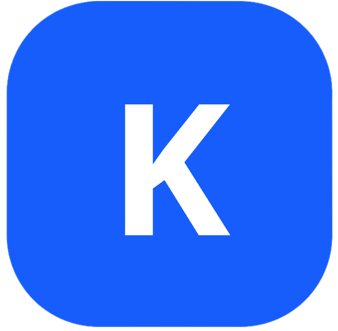

# KaryaMandiri 


**"Memberdayakan Tangan-Tangan Terampil, Membangun Kemandirian Bangsa."**

KaryaMandiri adalah platform inklusi ekonomi sektor informal berbasis model bisnis *crowdsourcing*. Platform ini dirancang untuk menjembatani kesenjangan akses bagi pekerja sektor informal (seperti kurir, tenaga sortir, pekerja harian, dan UMKM rumahan) ke dalam ekosistem digital yang terstruktur, transparan, dan berdaya saing.

## 🌐 Live Demo
Kunjungi platform kami di: [https://karya-mandiri.vercel.app](https://karya-mandiri.vercel.app)

---

## 🚀 Fitur Utama
*   **Crowdsourcing Engine:** Memecah proyek skala besar menjadi tugas mikro yang dapat dikerjakan secara kolaboratif oleh komunitas.
*   **Visual Trust System:** Portofolio berbasis multimedia yang memvalidasi keahlian pekerja melalui testimoni dan *community vouching*.
*   **Collective Procurement:** Fitur belanja kolektif untuk menekan biaya operasional mitra.
*   **Decision Support System (DSS):** Dasbor analitik untuk memonitor tren ekonomi sektor informal secara *real-time*.
*   **Smart-Contract Lite:** Kesepakatan kerja digital dengan bahasa sederhana untuk melindungi hak pekerja.

## 🛠 Tech Stack
Platform ini dibangun dengan teknologi modern untuk performa tinggi dan skalabilitas:
*   **Framework:** [Next.js 15+](https://nextjs.org/) (App Router)
*   **Styling:** [Tailwind CSS](https://tailwindcss.com/)
*   **Language:** TypeScript
*   **Database:** PostgreSQL (via Supabase)
*   **State Management:** Zustand / React Query
*   **Deployment:** [Vercel](https://vercel.com/)
*   **Tooling:** Postman (API Documentation), Zod (Validation)

## 📋 Struktur Proyek
```text
/app             # Next.js App Router (Pages & Layouts)
/components      # Reusable UI Components
/lib             # Konfigurasi Database & Server Actions
/types           # TypeScript Interfaces
/public          # Aset Statis
```

This is a [Next.js](https://nextjs.org) project bootstrapped with [`create-next-app`](https://nextjs.org/docs/app/api-reference/cli/create-next-app).

## Getting Started

First, run the development server:

```bash
npm run dev
# or
yarn dev
# or
pnpm dev
# or
bun dev
```

Open [http://localhost:3000](http://localhost:3000) with your browser to see the result.

You can start editing the page by modifying `app/page.tsx`. The page auto-updates as you edit the file.

This project uses [`next/font`](https://nextjs.org/docs/app/building-your-application/optimizing/fonts) to automatically optimize and load [Geist](https://vercel.com/font), a new font family for Vercel.

## Learn More

To learn more about Next.js, take a look at the following resources:

- [Next.js Documentation](https://nextjs.org/docs) - learn about Next.js features and API.
- [Learn Next.js](https://nextjs.org/learn) - an interactive Next.js tutorial.

You can check out [the Next.js GitHub repository](https://github.com/vercel/next.js) - your feedback and contributions are welcome!

## Deploy on Vercel

The easiest way to deploy your Next.js app is to use the [Vercel Platform](https://vercel.com/new?utm_medium=default-template&filter=next.js&utm_source=create-next-app&utm_campaign=create-next-app-readme) from the creators of Next.js.

Check out our [Next.js deployment documentation](https://nextjs.org/docs/app/building-your-application/deploying) for more details.
