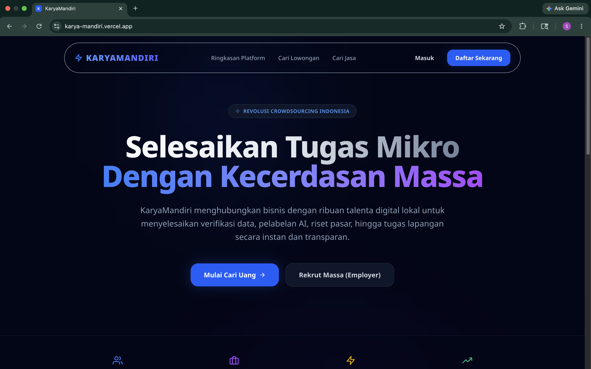
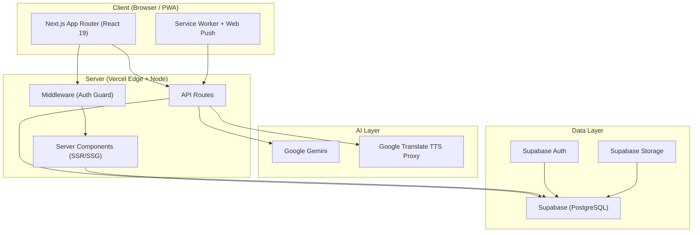
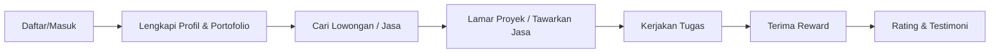
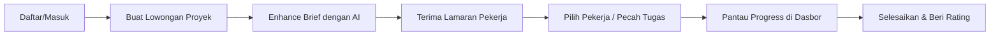

# KaryaMandiri




> **"Memberdayakan Tangan-Tangan Terampil, Membangun Kemandirian Bangsa."**

KaryaMandiri adalah platform inklusi ekonomi sektor informal berbasis model bisnis *crowdsourcing*. Platform ini menjembatani pekerja sektor informal (kurir, tenaga sortir, pekerja harian, UMKM rumahan) ke dalam ekosistem digital yang terstruktur, transparan, dan berdaya saing.

---

## 🌐 Tautan

| Jenis | Tautan |
|---|---|
| **Live Demo** | [https://karya-mandiri.vercel.app](https://karya-mandiri.vercel.app) |
| **Repository** | [github.com/syahrizaia/karya-mandiri](https://github.com/syahrizaia/karya-mandiri) |

---

## 📖 Daftar Isi

1. [Tentang Proyek](#-tentang-proyek)
2. [Masalah yang Diselesaikan](#-masalah-yang-diselesaikan)
3. [Fitur Utama](#-fitur-utama)
4. [Arsitektur Sistem](#-arsitektur-sistem)
5. [Struktur Proyek](#-struktur-proyek)
6. [Peta Halaman (Rute)](#-peta-halaman-rute)
7. [Tech Stack](#-tech-stack)
8. [Alur Kerja Pengguna](#-alur-kerja-pengguna)
9. [Prasyarat](#-prasyarat)
10. [Environment Variables](#-environment-variables)
11. [Menjalankan Proyek](#-menjalankan-proyek)
12. [Keamanan & Autentikasi](#-keamanan--autentikasi)
13. [Dokumentasi](#-dokumentasi)

---

## 🎯 Tentang Proyek

KaryaMandiri adalah **platform crowdsourcing** yang menghubungkan tiga pihak dalam satu ekosistem ekonomi digital:

1. **Employer / Pemberi Kerja** — individu maupun bisnis yang membutuhkan tenaga kerja atau jasa (proyek besar dipecah menjadi tugas mikro, atau lowongan kerja harian).
2. **Worker / Pekerja** — pekerja sektor informal (freelancer, kurir, tenaga sortir, UMKM) yang mencari penghasilan lewat tugas mikro dan proyek.
3. **Penyedia Jasa** — profesional yang menawarkan keahlian (fotografi, web, desain, dll.) sebagai layanan berbayar.

Nilai inti platform: **transparansi**, **kepercayaan visual**, dan **pemberdayaan ekonomi** bagi sektor informal yang selama ini belum terjangkau ekosistem digital formal.

---

## ⚡ Masalah yang Diselesaikan

| Masalah Nyata di Lapangan | Solusi KaryaMandiri |
|---|---|
| Pekerja informal sulit menemukan pekerjaan yang terstruktur & terpercaya | Pasar kerja crowdsourcing dengan sistem rating, portofolio, dan verifikasi |
| Proyek skala besar sulit dikerjakan satu orang / satu UMKM | *Crowdsourcing Engine* memecah proyek menjadi tugas mikro kolaboratif |
| Pemberi kerja kesulitan menilai kredibilitas pekerja | *Visual Trust System*: portofolio multimedia + testimoni + *community vouching* |
| Biaya operasional UMKM mitra tinggi | *Collective Procurement*: belanja kolektif untuk menekan biaya |
| Tidak ada gambaran tren ekonomi sektor informal | *Decision Support System (DSS)*: dasbor analitik *real-time* |
| Kesepakatan kerja verbal rawan sengketa | *Smart-Contract Lite*: kesepakatan digital berbahasa sederhana |
| Akses teknologi rendah (gawai terbatas, literasi rendah) | Asisten suara **Kama** + PWA offline-ready |

---

## 🚀 Fitur Utama

### 1. Crowdsourcing Engine
Memecah proyek skala besar menjadi **tugas mikro** yang dikerjakan banyak pekerja secara kolaboratif. Setiap tugas memiliki `reward`, `deadline`, dan `status` yang terlacak.

### 2. Visual Trust System
Sistem kepercayaan berbasis bukti visual:
- Portofolio multimedia (foto, video) per pekerja/jasa.
- Testimoni dari pemberi kerja.
- *Community vouching* — rekomendasi antar komunitas.
- Rating & ulasan terverifikasi.

### 3. Collective Procurement
Fitur belanja kolektif bagi mitra UMKM untuk menekan biaya operasional melalui pembelian bersama.

### 4. Decision Support System (DSS)
Dasbor analitik (`/general-dashboard`) menampilkan statistik ekonomi sektor informal secara *real-time*:
- Dampak ekonomi (total nilai proyek & penghasilan).
- Jumlah pekerja aktif & proyek berjalan.
- Tingkat pertumbuhan.
- Tren proyek & jasa (alokasi kategori).
- Aktivitas ekosistem terbaru.

### 5. Smart-Contract Lite
Kesepakatan kerja digital dengan bahasa sederhana — melindungi kedua pihak tanpa jargon hukum yang rumit.

### 6. Asisten Suara "Kama"
Asisten AI (Google Gemini) yang menerima **perintah suara** untuk:
- **NAVIGATE** — berpindah halaman.
- **SEARCH** — pencarian jasa/pekerjaan kontekstual.
- **OPEN_MODAL** — membuka formulir posting jasa/proyek.
- **SPEAK** — interaksi kasual (sapaan, bantuan umum).
- Text-to-Speech (TTS) berbahasa Indonesia untuk respons lisan.

### 7. AI Brief Enhancer
Peningkatan deskripsi berbasis AI untuk tiga konteks:
- **`brief`** — memoles deskripsi proyek agar profesional & menarik freelancer.
- **`profile`** — menulis ulang profil/portofolio freelancer agar persuasif.
- **`service`** — memoles penawaran jasa dengan struktur penjualan yang rapi.

### 8. PWA + Push Notification
- **Installable** — dapat dipasang di layar utama (Android/iOS/desktop).
- **Offline-ready** — service worker (`public/sw.js`).
- **Web Push** — notifikasi real-time via Web Push API + VAPID.

### 9. Manajemen Lowongan & Jasa
- **Pekerjaan (Jobs)** — buat, edit, hapus, filter, simpan, bagikan lowongan; tipe *Crowdsourcing* atau *Individu*.
- **Jasa (Services)** — buat, edit, hapus, bagikan layanan dengan kategori & harga.

### 10. Profil & Portofolio
- Profil pengguna dengan banner, avatar, bio, lokasi, keahlian (skills).
- Manajemen portofolio multimedia.
- Manajemen skills & saldo (wallet).
- Statistik performa.
- Bagikan profil & edit foto (crop gambar interaktif).
- Badge verifikasi.

### 11. Berita (News)
Halaman berita dengan kartu, header, dan skeleton loading untuk UX responsif.

### 12. Unduh Aplikasi (Download)
Halaman unduhan aplikasi dengan review pengguna.

---

## 🏗 Arsitektur Sistem



- **Frontend**: Next.js App Router dengan React Server Components, streaming, dan React Compiler.
- **Autentikasi & Data**: Supabase (PostgreSQL + Auth + Storage) via `@supabase/ssr`.
- **AI**: Google Gemini (`gemini-3.5-flash`) untuk asisten suara & enhancer; TTS via proxy Google Translate.
- **Middleware**: Proteksi rute privat + refresh sesi.

---

## 📋 Struktur Proyek

```text
karya-mandiri/
├── app/                        # Next.js App Router
│   ├── (auth)/                 # Rute autentikasi (login, register)
│   ├── (private)/              # Rute privat (butuh login)
│   │   ├── employer/           # Dasbor pemberi kerja
│   │   ├── worker/             # Dasbor pekerja
│   │   ├── history/            # Riwayat transaksi/aktivitas
│   │   ├── notification/       # Pusat notifikasi
│   │   └── settings/           # Pengaturan akun
│   ├── (public)/               # Rute publik (tanpa login)
│   │   ├── landing-page/       # Beranda
│   │   ├── general-dashboard/  # DSS dasbor analitik
│   │   ├── jobs/               # Katalog lowongan
│   │   ├── services/           # Katalog jasa
│   │   ├── news/               # Berita
│   │   ├── profile/            # Profil publik
│   │   ├── how-it-works/       # Cara kerja platform
│   │   ├── training/           # Pelatihan
│   │   ├── security/           # Kebijakan keamanan
│   │   ├── privacy/            # Kebijakan privasi
│   │   ├── terms/              # Syarat & ketentuan
│   │   ├── help-center/        # Pusat bantuan
│   │   ├── contact/            # Kontak
│   │   ├── download/           # Unduh aplikasi
│   │   └── maintenance/        # Halaman pemeliharaan
│   ├── api/                    # API routes (backend)
│   │   ├── ai/                 # AI (enhance, kama, tts)
│   │   ├── push/               # Web Push notification
│   │   └── webhooks/           # Webhook notifikasi
│   ├── types/                  # Definisi tipe TypeScript
│   ├── layout.tsx              # Root layout (font, SEO, PWA, tema)
│   ├── page.tsx                # Beranda (redirect ke landing page)
│   ├── robots.ts               # robots.txt
│   └── sitemap.ts              # sitemap.xml
├── components/                 # Komponen UI & fitur
│   ├── ai/                     # Asisten Kama
│   ├── dashboard/              # Kartu statistik, loading, progress
│   ├── employer/               # Kartu statistik, CRUD lowongan
│   ├── worker/                 # Manajemen jasa, skeleton
│   ├── jobs/                   # Filter, daftar, detail, share lowongan
│   ├── services/               # Kartu, detail, CRUD, share jasa
│   ├── profile/                # Header, edit, portofolio, skills
│   ├── history/                # Filter, header, tabel riwayat
│   ├── notification/           # Item notifikasi, states
│   ├── landing-page/           # Statistik, tren, eksplorasi, talenta
│   ├── news/                   # Kartu, header, skeleton berita
│   ├── pwa/                    # Loader & installer PWA
│   ├── settings/               # Ganti password, toggle, link
│   ├── subscription/           # Dialog langganan
│   ├── layout/                 # Layout dashboard (sidebar/nav)
│   ├── footer/                 # Footer
│   ├── ui/                     # UI primitives (shadcn/ui)
│   └── theme-provider.tsx      # Provider tema (light/dark)
├── lib/                        # Utilitas & klien
│   ├── db.ts                   # Klien Supabase browser
│   ├── supabase-browser.ts     # Klien Supabase (browser)
│   ├── supabase-server.ts      # Klien Supabase (server)
│   ├── admin.ts                # Klien Supabase service-role (admin)
│   ├── utils.ts                # cn() helper Tailwind
│   └── crop-image.ts           # Utilitas crop gambar
├── types/                      # Interface TypeScript global
├── public/                     # Aset statis (manifest, sw, ikon)
├── middleware.ts               # Proteksi rute + refresh sesi
├── next.config.ts              # Konfigurasi Next.js (React Compiler, image)
├── tailwind.config.ts          # Konfigurasi Tailwind
├── postcss.config.mjs          # Konfigurasi PostCSS
├── tsconfig.json               # Konfigurasi TypeScript
└── eslint.config.mjs           # Konfigurasi ESLint
```

---

## 🗺 Peta Halaman (Rute)

### Rute Publik — `(public)`

| Rute | Deskripsi |
|---|---|
| `/` | Beranda (landing page) |
| `/general-dashboard` | Dasbor analitik DSS (statistik ekonomi real-time) |
| `/jobs` | Katalog lowongan kerja/proyek |
| `/services` | Katalog jasa profesional |
| `/news` | Berita & artikel |
| `/profile/[id]` | Profil publik pengguna |
| `/how-it-works` | Cara kerja platform |
| `/training` | Program pelatihan |
| `/security` | Kebijakan keamanan |
| `/privacy` | Kebijakan privasi |
| `/terms` | Syarat & ketentuan |
| `/help-center` | Pusat bantuan |
| `/contact` | Kontak |
| `/download` | Unduh aplikasi |
| `/maintenance` | Halaman pemeliharaan |

### Rute Autentikasi — `(auth)`

| Rute | Deskripsi |
|---|---|
| `/login` | Masuk akun |
| `/register` | Daftar akun |

### Rute Privat — `(private)` *(butuh login)*

| Rute | Deskripsi |
|---|---|
| `/employer` | Dasbor pemberi kerja (kelola proyek, pekerja aktif) |
| `/worker` | Dasbor pekerja (kelola jasa, penghasilan) |
| `/history` | Riwayat aktivitas & transaksi |
| `/notification` | Pusat notifikasi |
| `/settings` | Pengaturan akun (profil, keamanan, tema, notifikasi) |

### API Routes — `api`

| Rute | Metode | Deskripsi |
|---|---|---|
| `/api/ai/enhance` | `POST` | AI Brief Enhancer (brief, profile, service) |
| `/api/ai/kama` | `POST` | Asisten suara Kama (parsing perintah → aksi) |
| `/api/ai/tts` | `POST` | Text-to-Speech Bahasa Indonesia |
| `/api/push` | `POST` | Kirim Web Push notification |
| `/api/webhooks/notification` | `POST` | Webhook notifikasi |

---

## 🛠 Tech Stack

| Layer | Teknologi |
|---|---|
| Framework | [Next.js 16](https://nextjs.org/) — App Router, React Compiler, Turbopack |
| UI | [React 19](https://react.dev/) |
| Styling | [Tailwind CSS v4](https://tailwindcss.com/) + [shadcn/ui](https://ui.shadcn.com/) + Radix UI |
| Language | TypeScript 5 |
| Database & Auth | [Supabase](https://supabase.com/) — PostgreSQL, `@supabase/ssr` |
| Animasi | Framer Motion |
| Ikon | Lucide React, React Icons |
| AI | Google Gemini (`@google/generative-ai`, `gemini-3.5-flash`) |
| PWA & Push | Service Worker + Web Push API (`web-push`) |
| Utilitas | `date-fns`, `clsx`, `tailwind-merge`, `class-variance-authority`, `sonner` (toast), `react-qr-code`, `react-easy-crop` |
| Efek Teks | `typewriter-effect` |
| Tema | `next-themes` (mode terang/gelap) |
| Deployment | [Vercel](https://vercel.com/) |

---

## 🔁 Alur Kerja Pengguna

### Alur Pekerja (Worker)



### Alur Pemberi Kerja (Employer)



---

## 🚦 Prasyarat

- **Node.js** 20+ (disarankan versi LTS terbaru)
- **npm** / **pnpm** / **yarn** (package manager)
- Akun [Supabase](https://supabase.com/) — PostgreSQL + Auth + Storage
- (Opsional) API key **Google Gemini** untuk fitur AI
- (Opsional) Kunci **VAPID** untuk fitur push notification

---

## ⚙️ Environment Variables

Buat file `.env.local` di root proyek:

```env
# Supabase (wajib)
NEXT_PUBLIC_SUPABASE_URL=
NEXT_PUBLIC_SUPABASE_ANON_KEY=
# Supabase service role (untuk operasi admin — JANGAN expose ke klien)
SUPABASE_SERVICE_ROLE_KEY=

# Situs (wajib)
NEXT_PUBLIC_SITE_URL=https://karya-mandiri.vercel.app

# AI — Google Gemini (opsional, untuk asisten Kama & enhancer)
GEMINI_API_KEY=

# Web Push / VAPID (opsional, untuk notifikasi)
NEXT_PUBLIC_VAPID_PUBLIC_KEY=
VAPID_PRIVATE_KEY=
```

> **Catatan keamanan:** `SUPABASE_SERVICE_ROLE_KEY` dan `VAPID_PRIVATE_KEY` adalah **rahasia server**. Jangan pernah menaruhnya di variabel `NEXT_PUBLIC_*` atau mengeksposnya ke browser.

---

## 🚀 Menjalankan Proyek

```bash
# 1. Install dependensi
npm install

# 2. Mode development (Turbopack)
npm run dev

# 3. Production build
npm run build

# 4. Jalankan hasil build
npm start

# 5. Lint
npm run lint
```

Buka [http://localhost:3000](http://localhost:3000).

---

## 🔐 Keamanan & Autentikasi

- **Proteksi rute** — `middleware.ts` memblokir akses ke rute privat (`/employer`, `/worker`, `/history`, `/notification`, `/settings`) bagi pengguna yang belum login, lalu mengarahkan ke `/login` dengan parameter `next` untuk redirect balik.
- **Sesi Supabase** — menggunakan `@supabase/ssr` untuk manajemen cookie sesi yang aman (server & browser).
- **Pemisahan klien**:
  - `lib/db.ts` & `lib/supabase-browser.ts` → klien publik (anon key).
  - `lib/supabase-server.ts` → klien server dengan konteks sesi.
  - `lib/admin.ts` → klien **service-role** (hanya server, untuk operasi admin).
- **Validasi input** — API routes memvalidasi input dan mengembalikan status HTTP yang tepat (`400`, `500`).

---

## 📚 Dokumentasi

- [Next.js](https://nextjs.org/docs)
- [Supabase SSR](https://supabase.com/docs/guides/auth/server-side/nextjs)
- [Tailwind CSS](https://tailwindcss.com/docs)
- [shadcn/ui](https://ui.shadcn.com/)
- [Web Push API](https://web.dev/push-notifications-web-push-protocol/)
- [Google Gemini API](https://ai.google.dev/gemini-api/docs)
